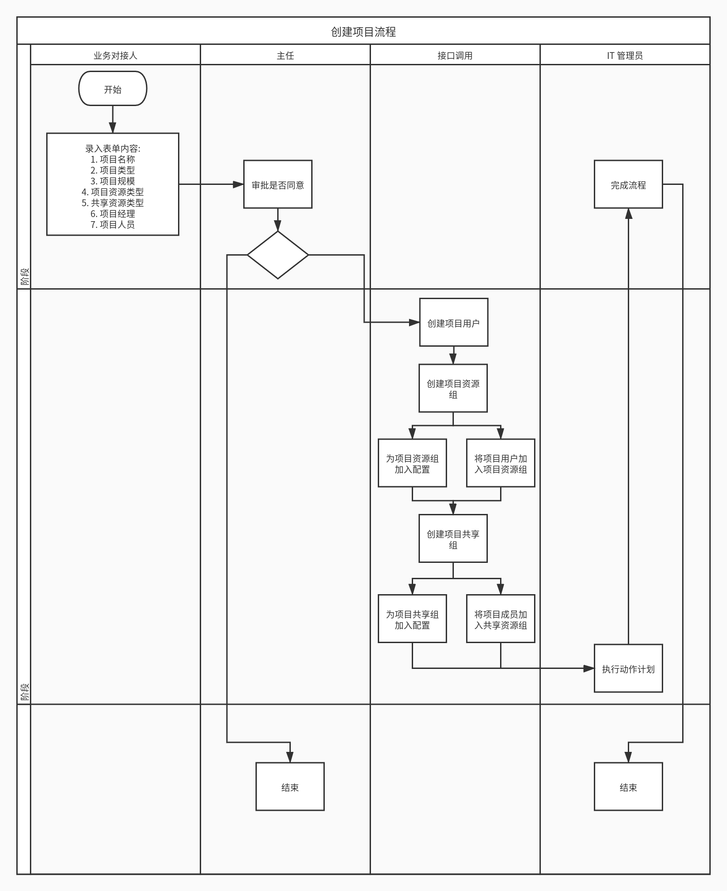
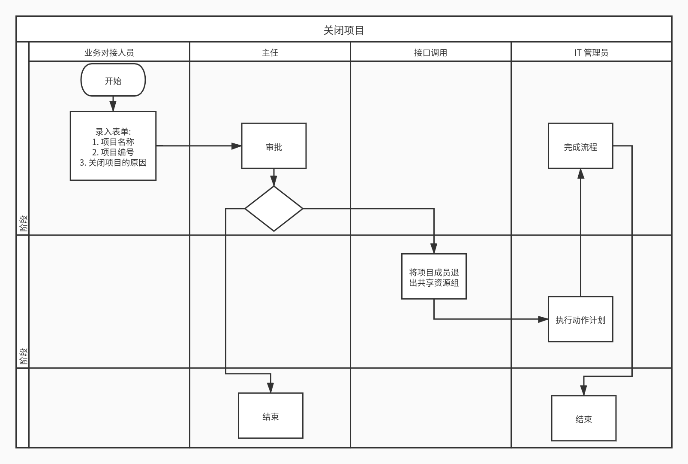
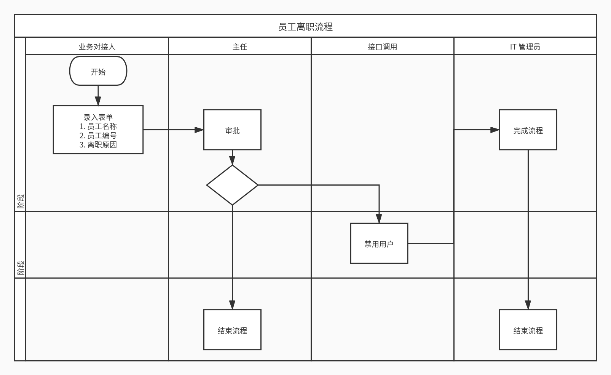

# 58 所流程示例

## 设计思路

因为以前设计过几个流程, 因此完全可以按照以前的流程创建流程示例.

现在所需做的是, 将以前设计的流程示例按照已有用户入职流程的范示进行简化, 并设计出流程表单和调用接口内容即可.

## 创建项目流程

创建项目流程与用户入职流程有一个非常大的区别, 就是用户入职只需要通过接口创建用户并将其加入用户组即可.

便创建项目流程不但要创建项目不但要创建项目用户, 还要创建项目资源组和项目共享资源组, 还要为组加入配置, 还要将已有用户加入组 ( 要求用户数据同步 ). 

因此有两个设计策略解决这个问题: 

* 一个是流程引擎调用接口完成所有平台工作, IT 管理员只执行动作计划;
* 另一个是流程引擎只调用创建项目用户的接口, 其他的工作由 IT 管理员根据流程表单手动处理.

当然也可以在两个策略间浮动, 反正就这么些个系统任务要完成, 要不然自动完成, 要不然手动完成.

这里的设计主要按照第一个策略来进行, 因为第二个微略其实只是手动完成第一个策略的工作罢了.

### 流程图

### 流程表单

* 项目名称: 项目的名字, 校验规则同 au 用户昵称规则.
* 项目编号: 项目在系统中的唯一标识, 校验规则同 au 用户名规则.
* 项目类型: 暂定以下固定值：
    * MCU
    * TPU
    * GPU
    * CPU
    * DSP
    * FGPA
* 项目规模: 暂定以下固定值:
    * 大型
    * 中型
    * 小型
* 项目资源类型: 暂定以下固定值:
    * 普通项目资源: base
* 共享资源类型: 暂定以下固定值
    * 普通共享资源: base
* 项目经理: 流程引擎用户 ( 只有一个 )
* 项目人员: 流程引擎用户 ( 可以有多个 )

### 调用接口

#### 创建项目用户

调用接口按以下规格创建一个用户

* 用户名 = `项目编号`
* 用户昵称 = `项目名称`
* 用户组织机构 =  "流程人员"

#### 创建项目资源组

调用接口按以下规格创建一个组:

* 组名 = `项目名称`+"项目资源组"
* 组的自定义属性 `project_name` = `项目编号`
* 组的自定义属性 `project_manager` = `项目经理`的`账号`
* 将以下值添加为组标签:
    * 项目类型
    * 项目规模

#### 为项目资源组加入配置

调用接口将自定义属性 `project_type`  的值等于 `项目资源类型` 的值的动作配置加入创建的项目资源组.

#### 创建项目共享组

调用接口按以下规格创建一个组:

* 组名 = `项目名称` + "项目资源组"
* 组的自定义属性 `project_name` = `项目编号`
* 组的自定义属性 `project_manager` = `项目经理`的账号

#### 为项目资源组加入配置

调用接口将自定义属性 `project_share_type` 的值等于 `项目共享类型` 的值的动作配罫加入创建的项目共享组.

#### 将项目成员加入共享资源组

调用接口将项目成员加入共享资源组.

## 关闭项目流程

### 流程图

### 流程表单

* 项目名称: 项目的名称 ( 已存在的项目 )
* 项目编号: 项目的编号 ( 已存在的项目 )
* 关闭项目的原因: 关闭项目的原因.

### 调用接口

#### 项目成员退组

将项目成员退出共享资源组.

## 员工离职流程

员工离职流程和关闭项目流程一样, 功能不复杂, 关键是执行的粒度. 

如果直接退组删用户, 可以会造成一些不可逆的后果. 所以还是采用一个比较折衷的方案: 禁用用户.

### 流程图

### 表单内容

* 员工名称: 员工的昵称, ( 已有用户 )
* 员工账号: 员工的用户名, ( 已有用户 )
* 离职原因: 文本.

### 接口调用

调用接口将用户名等于员工账号的用户禁用.

